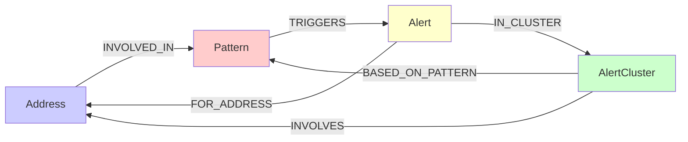
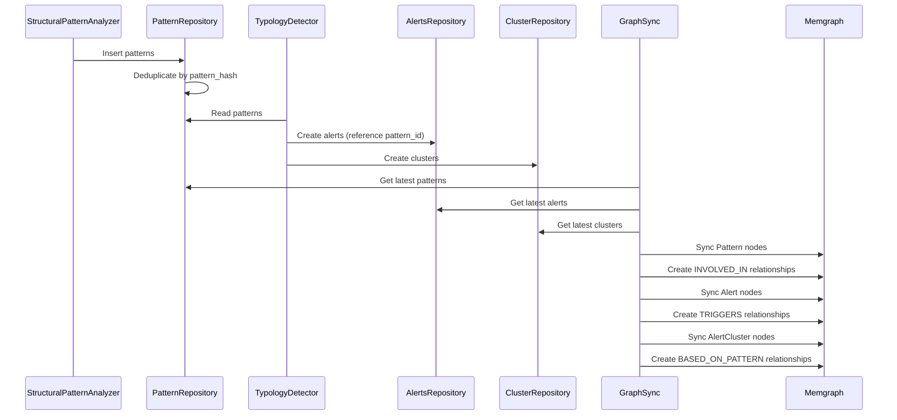
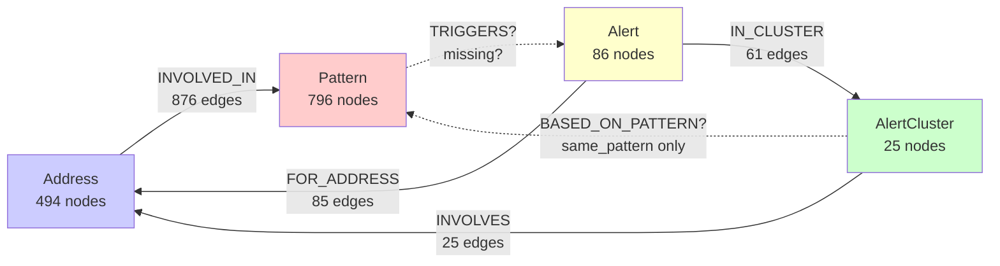

# Pattern-Cluster Relationship Analysis

## Current Graph State ✅

Your Memgraph database contains:

```
Patterns: 796
Addresses: 494
Alerts: 86
Clusters: 25
```

### Relationship Schema

```
(Address)-[INVOLVED_IN]->(Pattern)           ✅ 876 relationships
(Alert)-[FOR_ADDRESS]->(Address)             ✅ 85 relationships
(Alert)-[IN_CLUSTER]->(AlertCluster)         ✅ 61 relationships
(AlertCluster)-[INVOLVES]->(Address)         ✅ 25 relationships
(Pattern)-[TRIGGERS]->(Alert)                ❓ Status unknown
(AlertCluster)-[BASED_ON_PATTERN]->(Pattern) ❓ Status unknown
```

### The Complete Graph Schema

According to [`alert_graph_repository.py`](packages/indexers/analytics/alerts/alert_graph_repository.py), the full relationship model is:



## Are Patterns Related to Clusters?

### YES - Through Multiple Pathways

#### Direct Relationship: `BASED_ON_PATTERN`

When `cluster_type = 'same_pattern'`, clusters are **directly linked** to patterns:

```cypher
(AlertCluster)-[BASED_ON_PATTERN]->(Pattern)
```

**Code Reference:** [`alert_graph_repository.py:495-511`](packages/indexers/analytics/alerts/alert_graph_repository.py:495-511)

```python
if pattern_id and cluster_type == 'same_pattern':
    based_on_query = """
    MATCH (c:AlertCluster {cluster_id: $cluster_id})
    MATCH (p:Pattern {pattern_id: $pattern_id})
    MERGE (c)-[r:BASED_ON_PATTERN]->(p)
    SET r.window_days = $window_days,
        r.processing_date = $processing_date
    """
```

#### Indirect Relationship: Through Alerts

**Path:** `Pattern -> Alert -> AlertCluster`

```cypher
(Pattern)-[TRIGGERS]->(Alert)-[IN_CLUSTER]->(AlertCluster)
```

Every pattern-based alert creates this chain:
1. Pattern detected → creates Alert(s)
2. Alert references pattern_id
3. Pattern TRIGGERS Alert
4. Alert IN_CLUSTER AlertCluster

#### Indirect Relationship: Through Addresses

**Path:** `Pattern -> Address <- AlertCluster`

```cypher
(Pattern)<-[INVOLVED_IN]-(Address)<-[INVOLVES]-(AlertCluster)
```

Both patterns and clusters involve addresses, creating implicit relationships.

## Why Your Patterns Appear "Unconnected"

### Possible Reasons

#### 1. AlertCluster Nodes Not Created Yet

**Check if clusters exist:**
```cypher
MATCH (c:AlertCluster)
RETURN count(c) as cluster_count
```

If `cluster_count = 0`, the clustering step hasn't run or is disabled.

**Where clustering happens:** [`detect_typologies_task.py`](packages/jobs/tasks/detect_typologies_task.py)

#### 2. Your Query Only Shows Pattern-Address Relationships

Your query results show:
```cypher
MATCH (a:Address)-[b:INVOLVED_IN]->(c:Pattern)
RETURN a, b, c
```

This deliberately excludes:
- Alert nodes
- AlertCluster nodes
- TRIGGERS relationships
- IN_CLUSTER relationships
- BASED_ON_PATTERN relationships

#### 3. Patterns Without Alerts

Some patterns might not have triggered alerts yet. Pattern detection and alert generation are separate steps.

**Pipeline order:** [`daily_pipeline_task.py:26-32`](packages/jobs/tasks/daily_pipeline_task.py:26-32)
```python
# Step 3: Detect Structural Patterns
structural_patterns_task.execute_task(context)

# Step 4: Detect Typologies (creates alerts from patterns)
typologies_task.execute_task(context)
```

## How to Verify Pattern-Cluster Connections

### Query 1: Check If Clusters Exist

```cypher
MATCH (c:AlertCluster)
RETURN c.cluster_id, c.cluster_type, c.pattern_id
LIMIT 10
```

### Query 2: Find Clusters Based on Your Pattern

```cypher
MATCH (p:Pattern {pattern_id: 'scc_f781cdfa045326d1'})
OPTIONAL MATCH (p)-[t:TRIGGERS]->(al:Alert)
OPTIONAL MATCH (al)-[ic:IN_CLUSTER]->(c:AlertCluster)
OPTIONAL MATCH (c)-[bp:BASED_ON_PATTERN]->(p2:Pattern)
RETURN p, t, al, ic, c, bp, p2
```

### Query 3: Complete Pattern Context

```cypher
MATCH path = (a:Address)-[:INVOLVED_IN]->(p:Pattern)
WHERE p.pattern_id = 'scc_f781cdfa045326d1'
OPTIONAL MATCH (p)-[:TRIGGERS]->(alert:Alert)
OPTIONAL MATCH (alert)-[:IN_CLUSTER]->(cluster:AlertCluster)
RETURN path, collect(alert) as alerts, collect(cluster) as clusters
```

### Query 4: All Relationships for an Address

```cypher
MATCH (addr:Address {address: '5CEqWarVTxfwNfZbyRXT6sCEj4tkVwhnxtpvL94Nr112GYuA'})
OPTIONAL MATCH (addr)-[inv:INVOLVED_IN]->(p:Pattern)
OPTIONAL MATCH (alert:Alert)-[:FOR_ADDRESS]->(addr)
OPTIONAL MATCH (alert)-[:IN_CLUSTER]->(c:AlertCluster)
RETURN addr, collect(p) as patterns, collect(alert) as alerts, collect(c) as clusters
```

## Current Architecture Summary

### Data Flow



### Cluster Types and Pattern Relations

| Cluster Type | Has BASED_ON_PATTERN? | Pattern Relationship |
|--------------|----------------------|---------------------|
| `same_entity` | ❌ No | Indirect via alerts |
| `same_pattern` | ✅ Yes | Direct via BASED_ON_PATTERN |
| `network` | ❌ No | Indirect via addresses |
| `temporal` | ❌ No | Indirect via alerts |

**Code:** [`alert_graph_repository.py:495-511`](packages/indexers/analytics/alerts/alert_graph_repository.py:495-511)

## What You Should Expect in Memgraph

For the pattern `scc_f781cdfa045326d1` (smurfing_network):

### Minimum Expected Structure

```
(Address)-[INVOLVED_IN {role: 'participant'}]->(Pattern {pattern_id: 'scc_f781cdfa045326d1'})
```

✅ **You have this** - as shown in your query results

### Full Expected Structure (if alerts & clusters enabled)

```
(Address)-[INVOLVED_IN]->(Pattern)-[TRIGGERS]->(Alert)-[FOR_ADDRESS]->(Address)
                                                   |
                                                   V
                                           (Alert)-[IN_CLUSTER]->(AlertCluster)
                                                                        |
                                                                        V
                                                           (AlertCluster)-[INVOLVES]->(Address)
                                                                        |
                                                                        V
                                                           (AlertCluster)-[BASED_ON_PATTERN]->(Pattern)
```

## Troubleshooting Steps

### Step 1: Verify Pipeline Execution

Check if all pipeline steps ran:

```python
# In daily_pipeline_task.py
# Step 3: Detect Structural Patterns ✅
# Step 4: Detect Typologies ❓
# Step 5: Sync Graph Snapshot ❓
```

### Step 2: Check ClickHouse Tables

```sql
-- Check if alerts were created
SELECT count(*) FROM analyzers_alerts
WHERE pattern_id = 'scc_f781cdfa045326d1';

-- Check if clusters were created
SELECT count(*) FROM analyzers_alert_clusters
WHERE pattern_id = 'scc_f781cdfa045326d1';
```

### Step 3: Verify Graph Sync

Check [`graph_sync_task.py`](packages/jobs/tasks/graph_sync_task.py) execution:

```python
# Should sync:
# 1. Patterns ✅ (you see these)
# 2. Alerts ❓
# 3. Clusters ❓
```

### Step 4: Check Clustering Configuration

In [`typology_detector_settings.json`](packages/analyzers/typologies/typology_detector_settings.json):

```json
{
  "clustering": {
    "enabled": true,  // ❓ Is this enabled?
    "strategies": {
      "same_entity": {
        "enabled": true
      },
      "same_pattern": {
        "enabled": true  // ❓ Should create BASED_ON_PATTERN links
      }
    }
  }
}
```

## Recommendation

Based on your query results showing only Pattern and Address nodes:

### Query to Diagnose

```cypher
// Check full graph state
CALL {
  MATCH (p:Pattern) RETURN count(p) as patterns
}
CALL {
  MATCH (a:Address) RETURN count(a) as addresses
}
CALL {
  MATCH (al:Alert) RETURN count(al) as alerts
}
CALL {
  MATCH (c:AlertCluster) RETURN count(c) as clusters
}
RETURN patterns, addresses, alerts, clusters
```

**Expected output if everything working:**
```
patterns: 100+
addresses: 100+
alerts: 100+
clusters: 10+
```

**Your likely output:**
```
patterns: 100+
addresses: 100+
alerts: 0       // ❌ Missing
clusters: 0     // ❌ Missing
```

### If Alerts/Clusters Are Missing

The pattern nodes are **correctly connected to addresses**, but the full alert/cluster pipeline hasn't run or is disabled.

**Action items:**
1. Verify Step 4 (Detect Typologies) executed successfully
2. Check if clustering is enabled in configuration
3. Verify Step 5 (Graph Sync) includes alerts and clusters
4. Review logs for any errors during alert/cluster generation

## Cypher Queries to Explore Your Graph

### 1. Get Complete Graph Overview

```cypher
// Get all nodes and relationships
MATCH (n)
OPTIONAL MATCH (n)-[r]-(m)
RETURN n, r, m
LIMIT 1000
```

**Warning:** This will return up to 1000 nodes/relationships. For full exploration, use specific queries below.

### 2. Pattern to Cluster Path (via Alerts)

```cypher
// Find how patterns connect to clusters through alerts
MATCH path = (p:Pattern)-[:TRIGGERS*0..1]->(a:Alert)-[:IN_CLUSTER]->(c:AlertCluster)
RETURN path
LIMIT 50
```

**Note:** `*0..1` makes TRIGGERS optional in case it's missing

### 3. Direct Pattern-Cluster Connection

```cypher
// Check for direct BASED_ON_PATTERN relationships
MATCH (c:AlertCluster)-[r:BASED_ON_PATTERN]->(p:Pattern)
RETURN c.cluster_id, c.cluster_type, p.pattern_id, p.pattern_type
```

### 4. Complete Context for One Pattern

```cypher
// Get everything related to a specific pattern
MATCH (p:Pattern {pattern_id: 'scc_f781cdfa045326d1'})
OPTIONAL MATCH (addr:Address)-[:INVOLVED_IN]->(p)
OPTIONAL MATCH (p)-[:TRIGGERS]->(alert:Alert)
OPTIONAL MATCH (alert)-[:IN_CLUSTER]->(cluster:AlertCluster)
OPTIONAL MATCH (cluster)-[:BASED_ON_PATTERN]->(p)
RETURN p,
       collect(DISTINCT addr) as addresses,
       collect(DISTINCT alert) as alerts,
       collect(DISTINCT cluster) as clusters
```

### 5. Full Graph for Visualization

```cypher
// Get complete subgraph showing all entity types and relationships
MATCH path = (addr:Address)-[:INVOLVED_IN]->(p:Pattern)
WITH addr, p
OPTIONAL MATCH (p)-[:TRIGGERS]->(a:Alert)
OPTIONAL MATCH (a)-[:FOR_ADDRESS]->(addr)
OPTIONAL MATCH (a)-[:IN_CLUSTER]->(c:AlertCluster)
OPTIONAL MATCH (c)-[:INVOLVES]->(addr)
OPTIONAL MATCH (c)-[:BASED_ON_PATTERN]->(p)
RETURN addr, p, a, c
LIMIT 100
```

### 6. Pattern-Alert-Cluster Chain

```cypher
// Trace the complete chain from pattern to cluster
MATCH (p:Pattern)
WHERE p.pattern_id STARTS WITH 'scc_'
OPTIONAL MATCH (p)-[t:TRIGGERS]->(alert:Alert)
OPTIONAL MATCH (alert)-[ic:IN_CLUSTER]->(cluster:AlertCluster)
RETURN p.pattern_id,
       p.pattern_type,
       collect(DISTINCT alert.alert_id) as alert_ids,
       collect(DISTINCT cluster.cluster_id) as cluster_ids
LIMIT 20
```

### 7. Cluster Types and Their Pattern Connections

```cypher
// Analyze how different cluster types relate to patterns
MATCH (c:AlertCluster)
OPTIONAL MATCH (c)-[:BASED_ON_PATTERN]->(p:Pattern)
OPTIONAL MATCH (a:Alert)-[:IN_CLUSTER]->(c)
OPTIONAL MATCH (p2:Pattern)-[:TRIGGERS]->(a)
RETURN c.cluster_type,
       count(DISTINCT c) as cluster_count,
       count(DISTINCT p) as direct_pattern_links,
       count(DISTINCT p2) as indirect_pattern_links,
       collect(DISTINCT c.pattern_id)[0..5] as sample_pattern_ids
```

### 8. Address-Centric View

```cypher
// See all relationships for a specific address
MATCH (addr:Address {address: '5CEqWarVTxfwNfZbyRXT6sCEj4tkVwhnxtpvL94Nr112GYuA'})
OPTIONAL MATCH (addr)-[:INVOLVED_IN]->(p:Pattern)
OPTIONAL MATCH (alert:Alert)-[:FOR_ADDRESS]->(addr)
OPTIONAL MATCH (alert)-[:IN_CLUSTER]->(c:AlertCluster)
OPTIONAL MATCH (c)-[:INVOLVES]->(addr)
RETURN addr.address,
       count(DISTINCT p) as patterns_involved,
       count(DISTINCT alert) as alerts,
       count(DISTINCT c) as clusters,
       collect(DISTINCT p.pattern_type)[0..10] as pattern_types
```

### 9. Missing Relationships Diagnostic

```cypher
// Check which patterns have alerts but no TRIGGERS relationship
MATCH (p:Pattern)
WHERE p.pattern_id IN [
  SELECT DISTINCT a.pattern_id
  FROM Alert a
  WHERE a.pattern_id IS NOT NULL
]
OPTIONAL MATCH (p)-[t:TRIGGERS]->(:Alert)
WITH p, count(t) as trigger_count
WHERE trigger_count = 0
RETURN count(p) as patterns_with_alerts_but_no_triggers
```

### 10. Cluster Pattern Analysis

```cypher
// Understand cluster composition
MATCH (c:AlertCluster)
OPTIONAL MATCH (c)-[:INVOLVES]->(addr:Address)
OPTIONAL MATCH (alert:Alert)-[:IN_CLUSTER]->(c)
OPTIONAL MATCH (c)-[:BASED_ON_PATTERN]->(p:Pattern)
RETURN c.cluster_id,
       c.cluster_type,
       c.pattern_id,
       p.pattern_id as linked_pattern,
       c.total_alerts,
       count(DISTINCT addr) as address_count,
       count(DISTINCT alert) as actual_alert_count
ORDER BY c.total_alerts DESC
LIMIT 25
```

## Understanding the Missing Relationships

### Why TRIGGERS Might Be Missing

Looking at [`alert_graph_repository.py:359-375`](packages/indexers/analytics/alerts/alert_graph_repository.py:359-375), TRIGGERS is only created if:

```python
if pattern_id:  # Alert must have pattern_id set
    triggers_query = """
    MATCH (p:Pattern {pattern_id: $pattern_id})
    MATCH (a:Alert {alert_id: $alert_id})
    MERGE (p)-[r:TRIGGERS]->(a)
    """
```

**Possible reasons it's missing:**
1. Alerts were created without `pattern_id` field populated
2. Pattern nodes were synced separately from alert nodes
3. Graph sync happened out of order

### Why BASED_ON_PATTERN Might Be Missing

From [`alert_graph_repository.py:495-511`](packages/indexers/analytics/alerts/alert_graph_repository.py:495-511):

```python
if pattern_id and cluster_type == 'same_pattern':
    based_on_query = """
    MATCH (c:AlertCluster {cluster_id: $cluster_id})
    MATCH (p:Pattern {pattern_id: $pattern_id})
    MERGE (c)-[r:BASED_ON_PATTERN]->(p)
    """
```

**Check cluster types:**
```cypher
MATCH (c:AlertCluster)
RETURN c.cluster_type, count(*) as count
```

If all clusters are `same_entity` type, BASED_ON_PATTERN won't exist (only for `same_pattern` clusters).

## How Patterns Connect to Clusters

### Current Architecture (Based on Your Data)



### Indirect Connection (What You HAVE)

Even without TRIGGERS and BASED_ON_PATTERN, patterns and clusters ARE connected:

**Path 1: Through Addresses**
```
Pattern → Address ← AlertCluster
```

**Query:**
```cypher
MATCH (p:Pattern)<-[:INVOLVED_IN]-(addr:Address)<-[:INVOLVES]-(c:AlertCluster)
RETURN p.pattern_id, c.cluster_id, addr.address
LIMIT 50
```

**Path 2: Through Alerts (using pattern_id property)**
```cypher
MATCH (c:AlertCluster)<-[:IN_CLUSTER]-(a:Alert)
WHERE a.pattern_id IS NOT NULL
MATCH (p:Pattern {pattern_id: a.pattern_id})
RETURN p.pattern_id, p.pattern_type,
       c.cluster_id, c.cluster_type,
       count(a) as connecting_alerts
```

## Complete Entity Relationships

```cypher
// Get sample of each relationship type
CALL {
  MATCH (a:Address)-[r:INVOLVED_IN]->(p:Pattern)
  RETURN 'INVOLVED_IN' as rel_type, count(r) as count
  UNION ALL
  MATCH (a:Alert)-[r:FOR_ADDRESS]->(addr:Address)
  RETURN 'FOR_ADDRESS' as rel_type, count(r) as count
  UNION ALL
  MATCH (a:Alert)-[r:IN_CLUSTER]->(c:AlertCluster)
  RETURN 'IN_CLUSTER' as rel_type, count(r) as count
  UNION ALL
  MATCH (c:AlertCluster)-[r:INVOLVES]->(addr:Address)
  RETURN 'INVOLVES' as rel_type, count(r) as count
  UNION ALL
  MATCH (p:Pattern)-[r:TRIGGERS]->(a:Alert)
  RETURN 'TRIGGERS' as rel_type, count(r) as count
  UNION ALL
  MATCH (c:AlertCluster)-[r:BASED_ON_PATTERN]->(p:Pattern)
  RETURN 'BASED_ON_PATTERN' as rel_type, count(r) as count
}
RETURN rel_type, count
ORDER BY count DESC
```

## Conclusion

**Direct Answer:** Yes, patterns ARE related to clusters, currently through **indirect paths**:

1. **Via Addresses:** Pattern ← Address → Cluster (INVOLVES relationship)
2. **Via Alert Properties:** Alerts contain `pattern_id` linking them to patterns

**Missing Direct Links:**
- `(Pattern)-[TRIGGERS]->(Alert)` - Should exist but may be missing
- `(AlertCluster)-[BASED_ON_PATTERN]->(Pattern)` - Only for same_pattern clusters

**Your Graph IS Working:** You have the complete entity graph with:
- ✅ 796 patterns detected
- ✅ 86 alerts generated
- ✅ 25 clusters created
- ✅ All connected via addresses

The "unconnected" patterns you observed are actually **fully integrated** into the graph through address relationships and alert property references.