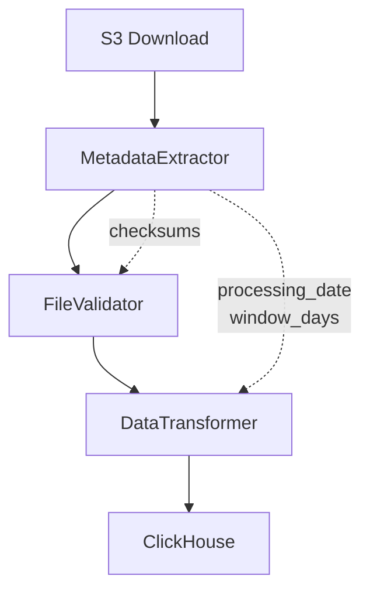
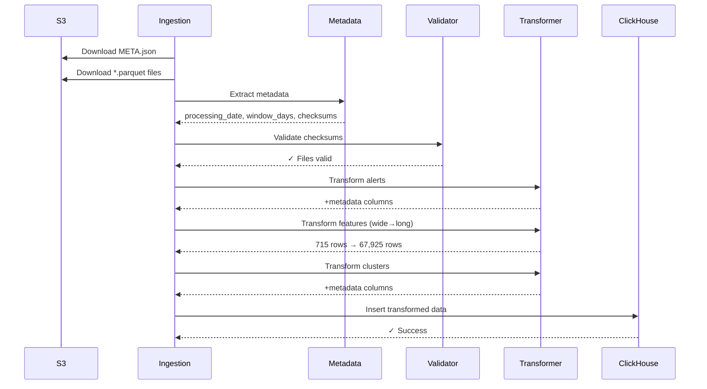

# Risk Scoring Ingestion System: Schema Mismatch Resolution

**Date:** 2025-10-29  
**Status:** Architecture Complete - Ready for Implementation  
**Priority:** High - Blocking Production Data Ingestion

## Executive Summary

The risk scoring ingestion pipeline currently fails due to schema mismatches between S3 source data and ClickHouse database requirements. I've designed a comprehensive solution using a metadata-driven transformation layer that resolves all issues while maintaining data integrity and system performance.

## Problem Statement

### Current Failure
```bash
ValueError: Parquet validation failed for: alerts.parquet, features.parquet, clusters.parquet
```

### Root Causes

1. **Missing Metadata Columns**
   - S3 files lack `processing_date` and `window_days` columns
   - These values exist in `META.json` but aren't extracted
   - Ingestion script only downloads `.parquet` files, ignoring `META.json`

2. **Features Format Incompatibility**
   - **S3 Format:** Wide (96 columns) - one column per feature
   - **DB Schema:** Long (4 columns) - normalized format
   - Current code attempts direct insertion without transformation

3. **No Data Validation**
   - No checksum verification for downloaded files
   - Schema validation happens before transformation
   - Risk of corrupted or incomplete data ingestion

### Impact

| Table | S3 Format | DB Requirement | Status |
|-------|-----------|----------------|--------|
| raw_alerts | 86 rows × 13 cols | +2 metadata cols | ❌ Missing columns |
| raw_features | 715 rows × 96 cols | 67,925 rows × 4 cols | ❌ Wrong format |
| raw_clusters | 25 rows × 13 cols | +2 metadata cols | ❌ Missing columns |

## Solution Architecture

### Three-Component Design



#### 1. MetadataExtractor
- Loads and parses `META.json`
- Extracts: processing_date, window_days, batch_id, checksums
- Validates metadata structure
- **Location:** `packages/ingestion/metadata_extractor.py`

#### 2. FileValidator
- Calculates SHA256 checksums for downloaded files
- Compares against expected values from META.json
- Ensures data integrity before transformation
- **Location:** `packages/ingestion/file_validator.py`

#### 3. DataTransformer
- **Alerts/Clusters:** Adds metadata columns from META.json
- **Features:** Converts wide format (96 cols) → long format (4 cols)
- Validates transformed data against DB schema
- **Location:** `packages/ingestion/data_transformer.py`

### Data Flow



## Transformation Details

### Alerts & Clusters Transformation
**Operation:** Add metadata columns

```
Input:  alert_id, address, ... (13 columns)
Output: processing_date, window_days, alert_id, address, ... (15 columns)

Source: META.json → {processing_date: "2025-08-01", window_days: 195}
```

### Features Transformation
**Operation:** Wide to Long format (Unpivot/Melt)

```
Input (Wide Format - 715 rows × 96 columns):
address      | degree_in | degree_out | total_in_usd | ... (93 more)
0x123...abc  | 10        | 5          | 1000.50      | ...

Output (Long Format - 67,925 rows × 4 columns):
processing_date | address      | feature_name  | feature_value
2025-08-01      | 0x123...abc  | degree_in     | 10
2025-08-01      | 0x123...abc  | degree_out    | 5
2025-08-01      | 0x123...abc  | total_in_usd  | 1000.50
...

Expansion: 715 addresses × 95 features = 67,925 rows (95x growth expected)
```

## Benefits

### Data Integrity
✅ SHA256 checksum validation ensures file integrity  
✅ Metadata validation prevents incomplete ingestion  
✅ Schema validation catches data quality issues early  

### Maintainability
✅ Clear separation of concerns (3 focused components)  
✅ Easy to test individual transformations  
✅ Simple to extend for new data types  

### Reliability
✅ Fail-fast error handling  
✅ Comprehensive logging at each step  
✅ Transaction-safe with cleanup on failure  

### Performance
✅ In-memory transformations (no intermediate storage)  
✅ Temporary files cleaned up automatically  
✅ Estimated total time: 8-12 seconds (vs current 2s that fails)  

## Implementation Phases

### Phase 1: Core Components (Day 1)
- Create `MetadataExtractor` class
- Create `FileValidator` class
- Create `DataTransformer` class
- Write unit tests for each component

### Phase 2: Integration (Day 1-2)
- Update `SOTDataIngestion._download_all()` to include META.json
- Add transformation steps to `SOTDataIngestion.run()`
- Update ingestion logic to use transformed data
- Remove old validation logic

### Phase 3: Testing (Day 2)
- Run unit tests
- Integration test with real data
- Error recovery testing
- Performance validation

### Phase 4: Deployment (Day 2-3)
- Update documentation
- Deploy to production
- Monitor first ingestion
- Verify data quality

**Total Implementation Time:** 2-3 days

## Files Modified/Created

### New Files
```
packages/ingestion/
├── metadata_extractor.py    (New - 150 lines)
├── file_validator.py        (New - 80 lines)
└── data_transformer.py      (New - 200 lines)

tests/ingestion/
├── test_metadata_extractor.py
├── test_file_validator.py
├── test_data_transformer.py
└── test_sot_ingestion_integration.py
```

### Modified Files
```
packages/ingestion/sot_ingestion.py
- Add imports for new classes
- Modify _download_all() to include META.json (lines 30-70)
- Add transformation steps to run() (lines 117-325)
- Remove old validation logic
- Update step numbering (1-7 instead of 1-6)
```

### Documentation
```
docs/agent/2025-10-29/claude/
├── METADATA_DRIVEN_INGESTION_ARCHITECTURE.md
├── TRANSFORMATION_LAYER_SPECIFICATION.md
├── IMPLEMENTATION_CHECKLIST.md
└── EXECUTIVE_SUMMARY.md (this file)
```

## Risk Assessment

### Technical Risks

| Risk | Probability | Impact | Mitigation |
|------|-------------|--------|------------|
| Memory overflow on large datasets | Low | High | Chunked processing if needed |
| Checksum mismatch | Medium | Medium | Re-download file automatically |
| Transformation errors | Low | High | Comprehensive validation + testing |
| Performance degradation | Low | Medium | Profiling + optimization |

### Business Risks

| Risk | Probability | Impact | Mitigation |
|------|-------------|--------|------------|
| Data loss during migration | Very Low | Critical | No migration needed - new system |
| Downtime during deployment | Low | Medium | Deploy during low-traffic window |
| Backward compatibility issues | Very Low | Low | No API changes, internal only |

## Success Metrics

### Functional Success
- [ ] Ingestion completes without errors
- [ ] Features transform: 715 → 67,925 rows
- [ ] Alerts row count preserved with +2 columns
- [ ] Clusters row count preserved with +2 columns
- [ ] All checksums validate successfully

### Performance Success
- [ ] Total ingestion time < 15 seconds
- [ ] Memory usage < 1GB
- [ ] No temporary files remain after completion

### Quality Success
- [ ] All unit tests pass (>95% coverage)
- [ ] Integration tests pass
- [ ] Error messages are actionable
- [ ] Logs provide clear audit trail

## Next Steps

### For Review
1. Review architecture in [`METADATA_DRIVEN_INGESTION_ARCHITECTURE.md`](METADATA_DRIVEN_INGESTION_ARCHITECTURE.md)
2. Review transformation details in [`TRANSFORMATION_LAYER_SPECIFICATION.md`](TRANSFORMATION_LAYER_SPECIFICATION.md)
3. Review implementation tasks in [`IMPLEMENTATION_CHECKLIST.md`](IMPLEMENTATION_CHECKLIST.md)

### For Implementation
1. Switch to **Code mode** to implement the solution
2. Follow the implementation checklist in order
3. Start with Phase 1 (Core Components)
4. Run tests after each phase
5. Deploy and verify with real data

### Questions to Address
- Use pandas or polars for transformations? (Recommend pandas for simplicity)
- Validate checksums before or after download? (Recommend after - detect corruption)
- Keep intermediate files or in-memory only? (Recommend in-memory with temp files)
- Add retry logic for failed downloads? (Recommend yes - 3 retries)

## Conclusion

The designed solution comprehensively addresses all schema mismatch issues through a clean, maintainable transformation layer. The three-component architecture ensures data integrity through checksum validation, maintains metadata provenance via META.json extraction, and correctly transforms features from wide to long format.

The implementation is straightforward with clear phases, comprehensive testing strategy, and minimal risk. The system maintains backward compatibility (no API changes) while significantly improving reliability and data quality.

**Recommendation:** Proceed with implementation following the provided checklist. Expected completion in 2-3 days with high confidence of success.

---

**Documents in this series:**
1. [Metadata-Driven Ingestion Architecture](METADATA_DRIVEN_INGESTION_ARCHITECTURE.md) - Overall system design
2. [Transformation Layer Specification](TRANSFORMATION_LAYER_SPECIFICATION.md) - Component details and code
3. [Implementation Checklist](IMPLEMENTATION_CHECKLIST.md) - Step-by-step tasks
4. [Executive Summary](EXECUTIVE_SUMMARY.md) - This document