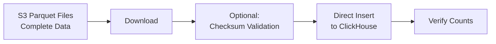

# Risk Scoring Ingestion: Final Summary

**Date:** 2025-10-29  
**Status:** Architecture Complete - Ready for Implementation  
**Implementation Time:** ~2.5 hours

## Situation

The risk scoring ingestion pipeline fails with schema validation errors:
```
ValueError: Parquet validation failed for: alerts.parquet, features.parquet, clusters.parquet
```

### Root Cause
Source parquet files from S3 were missing:
- Required metadata columns (`processing_date`, `window_days`)
- Features in wrong format (wide vs long)

## Solution Evolution

### Initial Approach (Complex)
Created transformation layer with 3 components to convert source data to match database schema:
- MetadataExtractor
- FileValidator  
- DataTransformer (features: 96 cols → 4 cols)

**Estimated time:** 2-3 days

### Simplified Approach (Current)
Source system updated to include all columns in parquet files → **No transformation needed!**

**Estimated time:** 2.5 hours

## Final Architecture



### What Changed in Source System
The external system now exports parquet files with:
- ✅ All required columns (`window_days`, `processing_date`)
- ✅ Features in wide format (96+ columns) matching our schema
- ✅ New table: money_flows
- ❌ No `_version` column (ClickHouse-specific, we don't need it)

### What We Need to Do
1. Update 3 schema files (alerts, features, clusters)
2. Create 1 new schema file (money_flows)
3. Update ingestion script to handle 4 tables instead of 3

**That's it!** No transformation, no complex logic.

## Implementation Details

### Schema Changes Required

| File | Action | Key Change |
|------|--------|------------|
| `raw_features.sql` | Replace | 4 cols → 96+ cols (wide format) |
| `raw_alerts.sql` | Update | Enum → String for severity |
| `raw_clusters.sql` | Update | Enum → String for severity_max |
| `raw_money_flows.sql` | Create | New table (19 columns) |

### Code Changes Required

**File:** [`packages/ingestion/sot_ingestion.py`](../../../packages/ingestion/sot_ingestion.py)

5 small changes:
1. Add `money_flows` to ingestion files list (~line 215)
2. Change validation count from 3 → 4 (~line 162)
3. Add `money_flows` to cleanup queries (~line 177)
4. Add `money_flows` to verification query (~line 282)
5. Update features validation (remove long-format columns) (~line 95)

## Tables Overview

### Table Specifications

| Table | Rows | Columns | Purpose |
|-------|------|---------|---------|
| raw_alerts | 86 | 16 | Alert records with typology classifications |
| raw_features | 715 | 96+ | Wide-format features per address |
| raw_clusters | 25 | 17 | Clustered alerts by pattern/entity |
| raw_money_flows | 842 | 19 | Aggregated money flows between addresses |

**Total data per batch:** ~0.37 MB (will scale with network activity)

### Schema Alignment

All schemas now match source system (`analyzers_*` tables) except:
- **Removed:** `_version` column (ReplacingMergeTree-specific)
- **Added:** `created_at` timestamp for audit trail
- **Changed:** Engine from ReplacingMergeTree → MergeTree
- **Changed:** Severity fields from Enum → String (more flexible)

## Documentation Delivered

### Primary Documents (Read These)

1. **[SIMPLIFIED_INGESTION_ARCHITECTURE.md](SIMPLIFIED_INGESTION_ARCHITECTURE.md)**
   - Overview of simplified architecture
   - Comparison with complex approach
   - Benefits and performance expectations

2. **[SCHEMA_SPECIFICATIONS.md](SCHEMA_SPECIFICATIONS.md)**
   - Complete SQL for all 4 tables
   - Copy-paste ready schema definitions
   - Validation checklist

3. **[SIMPLIFIED_IMPLEMENTATION_GUIDE.md](SIMPLIFIED_IMPLEMENTATION_GUIDE.md)**
   - Step-by-step implementation tasks
   - Exact code changes with line numbers
   - Testing steps and verification queries

4. **[FINAL_SUMMARY.md](FINAL_SUMMARY.md)** (this document)
   - Executive overview
   - Quick reference guide

### Historical Documents (Context Only)

These were created during initial analysis but superseded by simplified approach:

- `METADATA_DRIVEN_INGESTION_ARCHITECTURE.md` - Original complex solution
- `TRANSFORMATION_LAYER_SPECIFICATION.md` - Transformation details (not needed now)
- `IMPLEMENTATION_CHECKLIST.md` - Original checklist (outdated)
- `EXECUTIVE_SUMMARY.md` - Original summary (outdated)

## Implementation Steps

### Step 1: Update Schema Files (~30 min)
```bash
# Edit these files using schemas from SCHEMA_SPECIFICATIONS.md
packages/storage/schema/raw_features.sql      # Replace entire file
packages/storage/schema/raw_alerts.sql        # Update severity field
packages/storage/schema/raw_clusters.sql      # Update severity_max field
packages/storage/schema/raw_money_flows.sql   # Create new file
```

### Step 2: Update Ingestion Script (~1 hour)
```bash
# Edit: packages/ingestion/sot_ingestion.py
# 5 changes documented in SIMPLIFIED_IMPLEMENTATION_GUIDE.md
```

### Step 3: Test & Deploy (~1 hour)
```bash
# Drop old tables
clickhouse-client
DROP TABLE IF EXISTS risk_scoring_torus.raw_features;
DROP TABLE IF EXISTS risk_scoring_torus.raw_alerts;
DROP TABLE IF EXISTS risk_scoring_torus.raw_clusters;

# Create new schemas
python scripts/init_database.py --network torus

# Test ingestion
python packages/ingestion/sot_ingestion.py \
  --network torus \
  --processing-date 2025-08-01 \
  --days 195

# Verify
clickhouse-client
SELECT 'alerts' as table, count(*) FROM raw_alerts;
SELECT 'features' as table, count(*) FROM raw_features;
SELECT 'clusters' as table, count(*) FROM raw_clusters;
SELECT 'money_flows' as table, count(*) FROM raw_money_flows;
```

## Expected Results

### Before Implementation
```bash
❌ ValueError: Parquet validation failed
❌ Missing columns: window_days, processing_date
❌ Features format mismatch (wide vs long)
```

### After Implementation
```bash
✅ Downloaded 5 files (META.json + 4 parquet)
✅ All parquet files validated
✅ Ingested 86 rows into raw_alerts
✅ Ingested 715 rows into raw_features (96+ columns!)
✅ Ingested 25 rows into raw_clusters
✅ Ingested 842 rows into raw_money_flows
✅ Verification passed
✅ Ingestion workflow completed successfully
```

## Performance Expectations

| Metric | Estimate |
|--------|----------|
| Download time | 1-2s |
| Validation time | <1s |
| Ingestion time | 2-3s |
| Verification time | <1s |
| **Total** | **~5-7 seconds** |

**Memory usage:** <500MB (no transformation overhead)

## Risk Assessment

| Risk | Probability | Impact | Mitigation |
|------|-------------|--------|------------|
| Schema mismatch with source | Low | High | Coordinate with source team |
| Wrong data types | Very Low | Medium | Testing validates this |
| Missing columns | Very Low | High | Schema copied from source |
| Deployment issues | Low | Low | Simple changes, easy rollback |

## Rollback Plan

If something goes wrong:
1. Keep backup of old schema files
2. Revert schema changes
3. Revert code changes
4. Re-run `init_database.py`
5. Use old data format

**Risk:** Very low - changes are straightforward

## Success Criteria

Implementation is successful when:

- [ ] All 4 schema files created/updated
- [ ] Ingestion script handles 4 tables
- [ ] Test ingestion completes without errors
- [ ] raw_features has 96+ columns (wide format verified)
- [ ] All tables have expected row counts:
  - raw_alerts: 86 rows
  - raw_features: 715 rows  
  - raw_clusters: 25 rows
  - raw_money_flows: 842 rows
- [ ] Data types match source system
- [ ] Queries work against new schema

## Next Steps

### Option 1: Switch to Code Mode (Recommended)
```
You can switch to Code mode and I'll implement all changes following the 
SIMPLIFIED_IMPLEMENTATION_GUIDE.md step-by-step.
```

### Option 2: Manual Implementation
```
Follow SIMPLIFIED_IMPLEMENTATION_GUIDE.md yourself:
1. Update schema files (copy from SCHEMA_SPECIFICATIONS.md)
2. Update sot_ingestion.py (5 small changes)
3. Test with real data
```

### Option 3: Review First
```
Review the documentation, ask questions, then proceed with implementation.
```

## Questions & Answers

### Q: Why did we remove the transformation layer?
**A:** Source system now provides all columns in parquet files, so no transformation needed.

### Q: What happened to wide-to-long conversion for features?
**A:** Not needed anymore. We now use wide format (96+ columns) matching source.

### Q: Why String instead of Enum for severity?
**A:** More flexible, matches source system, easier to extend with new severity levels.

### Q: What about META.json and checksums?
**A:** Optional but recommended. Can add checksum validation for data integrity.

### Q: Can we revert to old schema?
**A:** Yes, but source system won't match anymore. Better to move forward.

### Q: What about existing data?
**A:** No migration needed - we always start from scratch (batch processing).

## Coordination with Source Team

### Source System Must Provide

✅ Parquet files with all columns (except `_version`)  
✅ META.json with checksums and metadata  
✅ Files for all 4 tables: alerts, features, clusters, money_flows  
✅ Consistent column names and data types  

### Our System Will Handle

✅ Downloading from S3  
✅ Optional checksum validation  
✅ Direct insertion to ClickHouse  
✅ Data verification  

## Summary

**Original Problem:** Complex schema mismatch requiring transformation layer  
**Simplified Solution:** Source provides complete data, direct insertion only  
**Implementation:** ~2.5 hours for schema alignment and 4th table support  
**Risk:** Very low - straightforward changes  
**Benefit:** Faster, simpler, more maintainable system  

---

**Ready to implement?** Switch to Code mode or follow the [SIMPLIFIED_IMPLEMENTATION_GUIDE.md](SIMPLIFIED_IMPLEMENTATION_GUIDE.md).

**Have questions?** Review the documentation or ask for clarification.

**Document Index:**
1. [SIMPLIFIED_INGESTION_ARCHITECTURE.md](SIMPLIFIED_INGESTION_ARCHITECTURE.md) - Architecture overview
2. [SCHEMA_SPECIFICATIONS.md](SCHEMA_SPECIFICATIONS.md) - SQL schemas
3. [SIMPLIFIED_IMPLEMENTATION_GUIDE.md](SIMPLIFIED_IMPLEMENTATION_GUIDE.md) - Implementation steps
4. [FINAL_SUMMARY.md](FINAL_SUMMARY.md) - This document