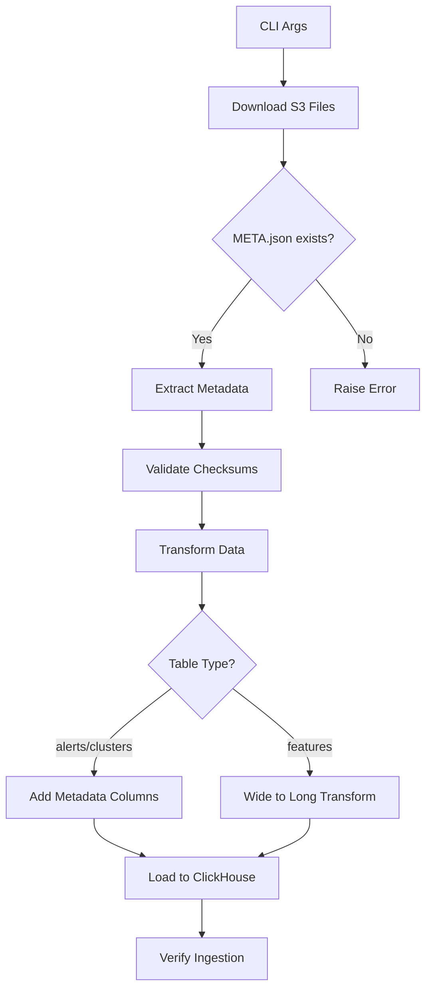
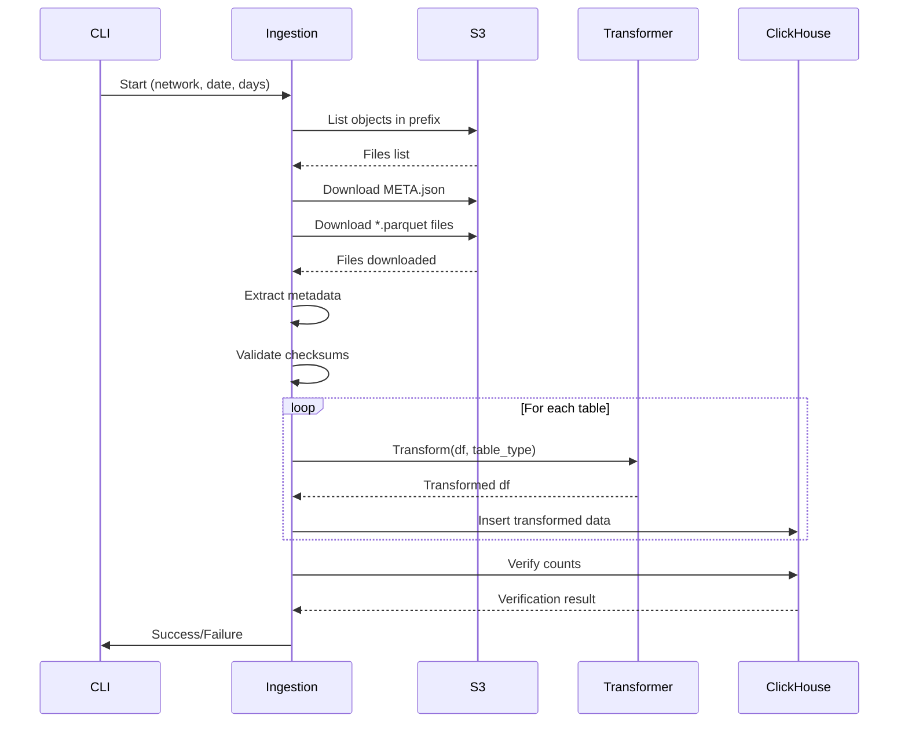

# Metadata-Driven Ingestion Architecture

**Date:** 2025-10-29  
**Status:** Planning  
**Author:** Architect Mode

## Problem Statement

The current ingestion system fails because of schema mismatches between S3 source data and ClickHouse target schema:

### Issues Identified

1. **Missing Metadata Columns**
   - S3 parquet files lack `processing_date` and `window_days` columns
   - These values exist in `META.json` but aren't extracted
   - Current code only downloads `.parquet` files (line 41 in [`sot_ingestion.py`](../../../packages/ingestion/sot_ingestion.py:41))

2. **Features Format Mismatch**
   - **S3 Format:** Wide format with 96 feature columns
   ```
   address | degree_in | degree_out | ... | confidence_score
   0x123   | 10        | 5          | ... | 0.95
   ```
   
   - **DB Schema:** Long format expecting 4 columns
   ```
   processing_date | address | feature_name | feature_value
   2025-08-01      | 0x123   | degree_in    | 10
   2025-08-01      | 0x123   | degree_out   | 5
   ```

3. **No Transformation Layer**
   - Direct parquet-to-ClickHouse insertion without data transformation
   - Validation checks for columns that don't exist in source

### Current vs Required Schema

#### raw_alerts
- **Current S3:** 13 columns (alert_id, address, typology_type, ...)
- **Required DB:** +2 columns (window_days, processing_date)
- **Source:** CLI args `--processing-date` and `--days`

#### raw_features  
- **Current S3:** 96 columns (wide format)
- **Required DB:** 4 columns (long format)
- **Transformation:** Unpivot/melt operation required

#### raw_clusters
- **Current S3:** 13 columns (cluster_id, cluster_type, ...)
- **Required DB:** +2 columns (window_days, processing_date)
- **Source:** CLI args `--processing-date` and `--days`

## Architecture Solution

### High-Level Flow



### Component Architecture

#### 1. MetadataExtractor
**Responsibility:** Extract and validate metadata from META.json

```python
class MetadataExtractor:
    def __init__(self, meta_path: Path):
        self.meta_path = meta_path
        self.metadata = {}
    
    def load(self) -> Dict:
        # Load META.json
        # Extract: processing_date, window_days, batch_id, counts, sha256
        
    def validate_structure(self) -> None:
        # Verify required fields exist
        
    def get_processing_date(self) -> str:
        # Return processing_date
        
    def get_window_days(self) -> int:
        # Return window_days
        
    def get_checksum(self, filename: str) -> str:
        # Return sha256 for file
```

#### 2. DataTransformer
**Responsibility:** Transform parquet data to match DB schema

```python
class DataTransformer:
    def __init__(self, processing_date: str, window_days: int):
        self.processing_date = processing_date
        self.window_days = window_days
    
    def transform_alerts(self, df: pd.DataFrame) -> pd.DataFrame:
        # Add processing_date and window_days columns
        
    def transform_clusters(self, df: pd.DataFrame) -> pd.DataFrame:
        # Add processing_date and window_days columns
        
    def transform_features(self, df: pd.DataFrame) -> pd.DataFrame:
        # Melt wide format to long format
        # Add processing_date column
        # Columns: address, feature_name, feature_value
```

#### 3. FileValidator
**Responsibility:** Validate downloaded files against checksums

```python
class FileValidator:
    def __init__(self, metadata: Dict):
        self.expected_checksums = metadata.get('sha256', {})
    
    def validate_checksum(self, file_path: Path) -> bool:
        # Calculate SHA256
        # Compare with expected
        
    def validate_all(self, files: List[Path]) -> None:
        # Validate all files
        # Raise if any mismatch
```

### Modified Ingestion Flow



## Implementation Plan

### Phase 1: Download Enhancement
- Modify [`_download_all()`](../../../packages/ingestion/sot_ingestion.py:30) to include `.json` files
- Add specific logic to download `META.json` first
- Extract metadata before downloading parquet files

### Phase 2: Metadata Extraction
- Create `MetadataExtractor` class
- Load and parse `META.json`
- Validate required fields
- Provide accessor methods

### Phase 3: Data Transformation Layer
- Create `DataTransformer` class
- Implement `transform_alerts()` - add metadata columns
- Implement `transform_clusters()` - add metadata columns  
- Implement `transform_features()` - wide to long conversion

### Phase 4: Validation Enhancement
- Create `FileValidator` class
- Implement SHA256 checksum validation
- Remove column validation from parquet files (schema check only)
- Validate post-transformation instead

### Phase 5: Integration
- Modify [`run()`](../../../packages/ingestion/sot_ingestion.py:117) method to use new components
- Add transformation step between download and ingestion
- Update logging to reflect new steps

## Technical Specifications

### Features Wide-to-Long Transformation

**Input Schema (96 columns):**
```
address, degree_in, degree_out, degree_total, unique_counterparties, 
total_in_usd, total_out_usd, ... (92 more feature columns)
```

**Output Schema (4 columns):**
```
processing_date, address, feature_name, feature_value
```

**Transformation Logic:**
```python
def transform_features(df: pd.DataFrame) -> pd.DataFrame:
    # Identify feature columns (all except 'address')
    feature_columns = [col for col in df.columns if col != 'address']
    
    # Melt/unpivot the dataframe
    df_long = df.melt(
        id_vars=['address'],
        value_vars=feature_columns,
        var_name='feature_name',
        value_name='feature_value'
    )
    
    # Add processing_date from metadata
    df_long['processing_date'] = self.processing_date
    
    # Reorder columns to match DB schema
    df_long = df_long[['processing_date', 'address', 'feature_name', 'feature_value']]
    
    return df_long
```

**Volume Impact:**
- Input: 715 rows × 96 columns = 715 addresses
- Output: 715 addresses × 95 features = 67,925 rows
- Expansion factor: ~95x rows (expected for long format)

### Metadata Columns Addition

**For alerts and clusters:**
```python
def add_metadata_columns(df: pd.DataFrame) -> pd.DataFrame:
    df['processing_date'] = pd.to_datetime(self.processing_date)
    df['window_days'] = self.window_days
    return df
```

### File Download Order

1. **META.json** - Download and parse first
2. **Validate metadata** - Ensure required fields exist
3. **alerts.parquet** - Download and validate checksum
4. **features.parquet** - Download and validate checksum
5. **clusters.parquet** - Download and validate checksum
6. **money_flows.parquet** - Download (not ingested yet)

### Error Handling Strategy

| Error Type | Action | Recovery |
|------------|--------|----------|
| META.json missing | Raise ValueError | Cannot proceed |
| Checksum mismatch | Raise ValueError | Re-download file |
| Transformation fails | Log error, raise | Manual intervention |
| Missing columns in wide format | Raise ValueError | Check source data |
| ClickHouse insert fails | Rollback partial data | Cleanup and retry |

## Data Quality Checks

### Pre-Transformation
- META.json structure validation
- SHA256 checksum verification
- Parquet file readability
- Row count matches META.json counts

### Post-Transformation
- Column presence validation
- Data type compatibility
- Non-null constraint checks
- Row count preservation (except features)

### Post-Ingestion
- Database row count verification
- Partition verification
- Index creation confirmation

## Performance Considerations

### Memory Efficiency
- **Features transformation:** 715 → 67,925 rows
- Use chunked processing for large datasets
- Consider polars/pyarrow for better performance

### Processing Time Estimates
- META.json download: <1s
- Parquet downloads: 1-2s total
- Checksum validation: <1s
- Features transformation: 1-2s (pandas melt operation)
- Metadata addition: <1s
- ClickHouse ingestion: 2-5s total

**Total expected time:** 8-12 seconds (current: ~2 seconds but fails)

## Migration Path

### Backward Compatibility
- Keep existing CLI interface unchanged
- Internal implementation change only
- No changes to database schema
- No changes to downstream consumers

### Testing Strategy
1. Unit tests for each transformer
2. Integration test with sample data
3. Checksum validation tests
4. End-to-end ingestion test
5. Verify with actual S3 data

## Dependencies

### Required Libraries
- **pandas** or **polars**: Data transformation
- **pyarrow**: Parquet file handling
- **hashlib**: SHA256 checksum calculation
- Existing: boto3, clickhouse-connect

### Configuration
- No new environment variables required
- Use existing S3 configuration
- Use existing ClickHouse configuration

## Benefits

1. **Data Integrity:** Checksum validation ensures file integrity
2. **Schema Compliance:** Automated transformation to DB schema
3. **Maintainability:** Clear separation of concerns
4. **Flexibility:** Easy to add new transformations
5. **Traceability:** Metadata preserved in database
6. **Reliability:** Fail-fast on validation errors

## Next Steps

1. Review and approve architecture
2. Implement Phase 1: Download enhancement
3. Implement Phase 2: Metadata extraction
4. Implement Phase 3: Transformation layer
5. Implement Phase 4: Validation enhancement
6. Implement Phase 5: Integration
7. Test with real data
8. Deploy to production

---

**Questions for Review:**

1. Should we use pandas or polars for transformations? (polars is faster but pandas is more familiar)
2. Should we validate checksums before or after transformation?
3. Should we keep intermediate transformed files on disk or transform in-memory?
4. Should we add retry logic for failed downloads?
5. Should we parallelize transformations for multiple files?