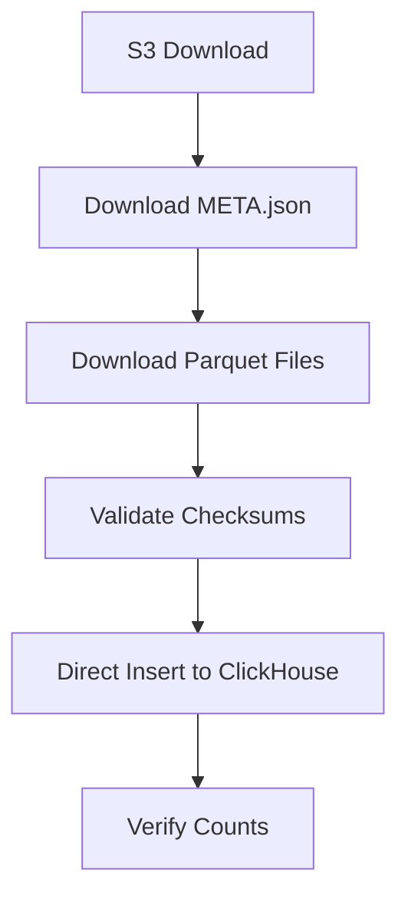

# Simplified Ingestion Architecture (Source System Alignment)

**Date:** 2025-10-29  
**Status:** Updated Architecture - Source System Provides Complete Data  
**Supersedes:** METADATA_DRIVEN_INGESTION_ARCHITECTURE.md

## Architecture Change

The source system will be modified to include all required columns in parquet files (except `_version` which is ClickHouse-specific). This eliminates the need for data transformation.

### What Changed

**Before (Complex):**
- Transform features from wide (96 cols) → long (4 cols)
- Add metadata columns from META.json
- Data transformation layer with 3 components

**After (Simple):**
- Direct parquet → ClickHouse insertion
- All columns already present in parquet files
- Only need checksum validation from META.json

## Simplified Flow



## Schema Alignment

### Tables to Ingest

| Table | Source | Columns | Notes |
|-------|--------|---------|-------|
| raw_features | analyzers_features | 96+ cols | Wide format, no transformation |
| raw_alerts | analyzers_alerts | ~15 cols | Severity as String not Enum |
| raw_clusters | analyzers_alert_clusters | ~15 cols | Severity as String not Enum |
| raw_money_flows | core_money_flows_view | ~18 cols | New table based on view |

### Key Differences from Source

1. **No `_version` column** - ClickHouse handles versioning differently
2. **No ReplacingMergeTree** - Using MergeTree with partitioning
3. **Simplified indexes** - Only essential indexes for our use case
4. **Table name prefix** - `raw_` prefix for source data tables

## Updated Ingestion Process

### Step 1: Download from S3
```python
# Download order:
1. META.json (metadata and checksums)
2. alerts.parquet
3. features.parquet  
4. clusters.parquet
5. money_flows.parquet (new!)
```

### Step 2: Validate Files
```python
# Using FileValidator from META.json checksums
validator.validate_all([
    'alerts.parquet',
    'features.parquet',
    'clusters.parquet',
    'money_flows.parquet'
])
```

### Step 3: Direct Insert
```python
# No transformation - direct insert
for table, filename in ingestion_files.items():
    client.insert_file(
        table=table,
        file_path=filename,
        fmt='Parquet'
    )
```

## Components Needed

### Minimal Components (vs. Original 3)

1. **MetadataExtractor** ✅ Keep - for checksum validation
2. **FileValidator** ✅ Keep - for integrity checks
3. **DataTransformer** ❌ Remove - not needed!

## Modified Files

### Schema Files to Update/Create

1. **Update:** `packages/storage/schema/raw_features.sql`
   - Change from long format (4 cols) to wide format (96+ cols)
   - Match `analyzers_features` schema (minus `_version`)

2. **Update:** `packages/storage/schema/raw_alerts.sql`
   - Change `severity` from Enum to String
   - Ensure all columns match `analyzers_alerts`

3. **Update:** `packages/storage/schema/raw_clusters.sql`
   - Change `severity_max` from Enum to String
   - Ensure all columns match `analyzers_alert_clusters`

4. **Create:** `packages/storage/schema/raw_money_flows.sql`
   - Based on `core_money_flows_view`
   - Store as regular table (not view)

### Ingestion Code Updates

**File:** `packages/ingestion/sot_ingestion.py`

Changes needed:
1. Add `money_flows.parquet` to download list
2. Add `raw_money_flows` to ingestion tables
3. Update validation to expect 4 tables (not 3)
4. Keep checksum validation logic
5. Remove any transformation logic (if present)

## Data Flow Comparison

### Old Flow (Complex)
```
S3 Parquet → MetadataExtractor → FileValidator → DataTransformer → ClickHouse
                                                      ↓
                                              715 → 67,925 rows
                                              96 → 4 columns
```

### New Flow (Simple)
```
S3 Parquet → FileValidator → ClickHouse
         ↓                        ↓
    All columns             Direct insert
    already present         No transformation
```

## Implementation Simplification

### What We Don't Need Anymore

- ❌ DataTransformer class
- ❌ Wide-to-long conversion logic
- ❌ Metadata column injection
- ❌ Temporary transformed parquet files
- ❌ Complex transformation tests

### What We Still Need

- ✅ MetadataExtractor (for checksums)
- ✅ FileValidator (for data integrity)
- ✅ Updated schema files
- ✅ money_flows table support

## Benefits of Simplified Approach

### Technical Benefits
- **Faster ingestion**: No transformation overhead
- **Less memory**: No dataframe manipulations
- **Simpler code**: Direct parquet → ClickHouse
- **Fewer failure points**: Less processing steps

### Operational Benefits
- **Easier debugging**: Direct data flow
- **Better performance**: No CPU overhead for transformations
- **Simpler testing**: Validate schemas only
- **Lower maintenance**: Less code to maintain

## Updated Schema Requirements

### Features Table
```sql
-- BEFORE (Long format - 4 columns):
processing_date, address, feature_name, feature_value

-- AFTER (Wide format - 96+ columns):
window_days, processing_date, address,
degree_in, degree_out, total_in_usd, ... (90+ more)
```

### Money Flows Table (New)
```sql
-- Based on core_money_flows_view
from_address, to_address, tx_count, amount_sum,
amount_usd_sum, first_seen_timestamp, last_seen_timestamp,
active_days, avg_tx_size_usd, unique_assets, dominant_asset,
hourly_pattern, weekly_pattern, reciprocity_ratio, is_bidirectional
```

## Migration Notes

### For Existing Systems
- Schema changes will require DROP/CREATE of tables
- No data migration needed (starting from scratch)
- Existing code can be simplified significantly

### For New Implementations
- Use updated schema files
- Follow simplified ingestion flow
- No transformation layer needed

## Performance Expectations

### Ingestion Time
- **Download:** 1-2s (4 files)
- **Checksum validation:** <1s
- **Direct insert:** 2-3s (4 tables)
- **Verification:** <1s
- **Total:** ~5-7 seconds (vs. 8-12 with transformation)

### Memory Usage
- **Peak:** <500MB (no transformation overhead)
- **Temp storage:** Minimal (parquet files only)

## Next Steps

1. Create/update schema files to match source system
2. Add money_flows support to ingestion script
3. Remove transformation layer code (if any exists)
4. Update validation to handle 4 tables
5. Test with real S3 data

---

**Summary:** The architecture is now much simpler - direct parquet insertion with checksum validation only. No transformation layer needed since source system provides complete data.