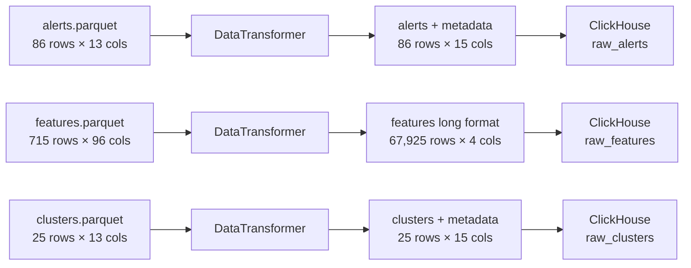

# Transformation Layer Specification

**Date:** 2025-10-29  
**Component:** Data Transformation Layer  
**Purpose:** Transform S3 parquet data to ClickHouse schema format

## Overview

The transformation layer bridges the gap between S3 source data format and ClickHouse target schema. It performs three key operations:

1. **Metadata Injection:** Add `processing_date` and `window_days` to alerts and clusters
2. **Format Conversion:** Transform features from wide to long format
3. **Data Validation:** Ensure transformed data meets DB constraints

## Component Design

### 1. MetadataExtractor

**File:** `packages/ingestion/metadata_extractor.py`

**Purpose:** Extract and validate metadata from META.json

```python
from pathlib import Path
from typing import Dict
import json
from loguru import logger


class MetadataExtractor:
    
    def __init__(self, meta_path: Path):
        self.meta_path = meta_path
        self.metadata: Dict = {}
        self._loaded = False
    
    def load(self) -> Dict:
        if not self.meta_path.exists():
            raise FileNotFoundError(f"META.json not found at {self.meta_path}")
        
        with open(self.meta_path, 'r') as f:
            self.metadata = json.load(f)
        
        self._loaded = True
        logger.info(f"Loaded metadata from {self.meta_path}")
        
        self._validate_structure()
        return self.metadata
    
    def _validate_structure(self) -> None:
        required_fields = [
            'schema_version',
            'batch_id',
            'network',
            'processing_date',
            'window_days',
            'generated_at',
            'counts',
            'sha256'
        ]
        
        missing = [field for field in required_fields if field not in self.metadata]
        
        if missing:
            raise ValueError(f"Missing required fields in META.json: {missing}")
        
        required_counts = ['alerts', 'features', 'clusters']
        missing_counts = [c for c in required_counts if c not in self.metadata['counts']]
        
        if missing_counts:
            raise ValueError(f"Missing count fields in META.json: {missing_counts}")
        
        logger.success("META.json structure validated")
    
    def get_processing_date(self) -> str:
        self._ensure_loaded()
        return self.metadata['processing_date']
    
    def get_window_days(self) -> int:
        self._ensure_loaded()
        return self.metadata['window_days']
    
    def get_network(self) -> str:
        self._ensure_loaded()
        return self.metadata['network']
    
    def get_batch_id(self) -> str:
        self._ensure_loaded()
        return self.metadata['batch_id']
    
    def get_expected_count(self, table: str) -> int:
        self._ensure_loaded()
        counts_map = {
            'alerts': 'alerts',
            'features': 'features',
            'clusters': 'clusters',
            'money_flows': 'money_flows'
        }
        
        if table not in counts_map:
            raise ValueError(f"Unknown table: {table}")
        
        return self.metadata['counts'][counts_map[table]]
    
    def get_checksum(self, filename: str) -> str:
        self._ensure_loaded()
        
        if filename not in self.metadata['sha256']:
            raise ValueError(f"No checksum for {filename} in META.json")
        
        return self.metadata['sha256'][filename]
    
    def _ensure_loaded(self) -> None:
        if not self._loaded:
            raise RuntimeError("Metadata not loaded. Call load() first.")
```

### 2. FileValidator

**File:** `packages/ingestion/file_validator.py`

**Purpose:** Validate file integrity using SHA256 checksums

```python
from pathlib import Path
from typing import Dict, List
import hashlib
from loguru import logger


class FileValidator:
    
    def __init__(self, expected_checksums: Dict[str, str]):
        self.expected_checksums = expected_checksums
    
    def calculate_sha256(self, file_path: Path) -> str:
        sha256_hash = hashlib.sha256()
        
        with open(file_path, "rb") as f:
            for byte_block in iter(lambda: f.read(4096), b""):
                sha256_hash.update(byte_block)
        
        return sha256_hash.hexdigest()
    
    def validate_checksum(self, file_path: Path) -> bool:
        filename = file_path.name
        
        if filename not in self.expected_checksums:
            logger.warning(f"No expected checksum for {filename}, skipping validation")
            return True
        
        expected = self.expected_checksums[filename]
        actual = self.calculate_sha256(file_path)
        
        if actual != expected:
            logger.error(
                f"Checksum mismatch for {filename}",
                extra={
                    "expected": expected,
                    "actual": actual
                }
            )
            return False
        
        logger.success(f"Checksum validated for {filename}")
        return True
    
    def validate_all(self, file_paths: List[Path]) -> None:
        failed = []
        
        for file_path in file_paths:
            if not self.validate_checksum(file_path):
                failed.append(file_path.name)
        
        if failed:
            raise ValueError(f"Checksum validation failed for: {', '.join(failed)}")
        
        logger.success(f"All checksums validated ({len(file_paths)} files)")
```

### 3. DataTransformer

**File:** `packages/ingestion/data_transformer.py`

**Purpose:** Transform parquet data to match ClickHouse schema

```python
from pathlib import Path
from typing import Optional
import pandas as pd
from loguru import logger


class DataTransformer:
    
    def __init__(self, processing_date: str, window_days: int):
        self.processing_date = processing_date
        self.window_days = window_days
    
    def transform_alerts(self, file_path: Path) -> pd.DataFrame:
        logger.info(f"Transforming alerts from {file_path}")
        
        df = pd.read_parquet(file_path)
        original_count = len(df)
        
        df['processing_date'] = pd.to_datetime(self.processing_date)
        df['window_days'] = self.window_days
        
        self._validate_alerts_schema(df)
        
        logger.success(
            f"Alerts transformed: {original_count} rows",
            extra={"rows": len(df), "columns": len(df.columns)}
        )
        
        return df
    
    def transform_clusters(self, file_path: Path) -> pd.DataFrame:
        logger.info(f"Transforming clusters from {file_path}")
        
        df = pd.read_parquet(file_path)
        original_count = len(df)
        
        df['processing_date'] = pd.to_datetime(self.processing_date)
        df['window_days'] = self.window_days
        
        self._validate_clusters_schema(df)
        
        logger.success(
            f"Clusters transformed: {original_count} rows",
            extra={"rows": len(df), "columns": len(df.columns)}
        )
        
        return df
    
    def transform_features(self, file_path: Path) -> pd.DataFrame:
        logger.info(f"Transforming features from {file_path}")
        
        df = pd.read_parquet(file_path)
        original_count = len(df)
        original_columns = len(df.columns)
        
        if 'address' not in df.columns:
            raise ValueError("Features dataframe must have 'address' column")
        
        feature_columns = [col for col in df.columns if col != 'address']
        
        logger.info(
            f"Melting features: {original_count} rows × {len(feature_columns)} features",
            extra={
                "addresses": original_count,
                "features": len(feature_columns),
                "expected_output_rows": original_count * len(feature_columns)
            }
        )
        
        df_long = df.melt(
            id_vars=['address'],
            value_vars=feature_columns,
            var_name='feature_name',
            value_name='feature_value'
        )
        
        df_long['processing_date'] = pd.to_datetime(self.processing_date)
        
        df_long = df_long[['processing_date', 'address', 'feature_name', 'feature_value']]
        
        self._validate_features_schema(df_long)
        
        logger.success(
            f"Features transformed: {original_count} addresses × {len(feature_columns)} features = {len(df_long)} rows",
            extra={
                "input_rows": original_count,
                "input_columns": original_columns,
                "output_rows": len(df_long),
                "expansion_factor": len(df_long) / original_count
            }
        )
        
        return df_long
    
    def _validate_alerts_schema(self, df: pd.DataFrame) -> None:
        required_columns = [
            'alert_id', 'processing_date', 'window_days', 'address',
            'typology_type', 'severity', 'alert_confidence_score',
            'description', 'evidence_json', 'risk_indicators'
        ]
        
        missing = [col for col in required_columns if col not in df.columns]
        
        if missing:
            raise ValueError(f"Missing required columns in alerts: {missing}")
        
        if df['alert_id'].isnull().any():
            raise ValueError("alert_id cannot be null")
        
        if df['address'].isnull().any():
            raise ValueError("address cannot be null")
    
    def _validate_clusters_schema(self, df: pd.DataFrame) -> None:
        required_columns = [
            'cluster_id', 'processing_date', 'window_days', 'cluster_type',
            'primary_alert_id', 'total_alerts', 'total_volume_usd'
        ]
        
        missing = [col for col in required_columns if col not in df.columns]
        
        if missing:
            raise ValueError(f"Missing required columns in clusters: {missing}")
        
        if df['cluster_id'].isnull().any():
            raise ValueError("cluster_id cannot be null")
    
    def _validate_features_schema(self, df: pd.DataFrame) -> None:
        required_columns = ['processing_date', 'address', 'feature_name', 'feature_value']
        
        missing = [col for col in required_columns if col not in df.columns]
        
        if missing:
            raise ValueError(f"Missing required columns in features: {missing}")
        
        if df['address'].isnull().any():
            raise ValueError("address cannot be null in features")
        
        if df['feature_name'].isnull().any():
            raise ValueError("feature_name cannot be null in features")
```

## Integration with SOTDataIngestion

### Modified Download Process

**Changes to [`_download_all()`](../../../packages/ingestion/sot_ingestion.py:30):**

```python
def _download_all(self) -> int:
    try:
        response = self.s3_client.list_objects_v2(
            Bucket=self.bucket,
            Prefix=self.s3_prefix
        )

        if 'Contents' not in response:
            logger.warning(f"No files found in S3 at {self.s3_prefix}")
            return 0

        # Download META.json first
        meta_key = f"{self.s3_prefix}/META.json"
        meta_objects = [obj for obj in response['Contents'] if obj['Key'] == meta_key]
        
        if not meta_objects:
            raise FileNotFoundError(f"META.json not found in {self.s3_prefix}")
        
        self._download_file(meta_key)
        logger.success("Downloaded META.json")
        
        # Download parquet files
        parquet_files = [obj['Key'] for obj in response['Contents'] if obj['Key'].endswith('.parquet')]
        
        if not parquet_files:
            raise ValueError(f"No parquet files found in {self.s3_prefix}")
        
        logger.info(f"Found {len(parquet_files)} parquet files to download")
        
        downloaded_count = 1  # META.json already downloaded
        
        for s3_key in parquet_files:
            if terminate_event.is_set():
                logger.warning("Termination requested during download")
                return downloaded_count
            
            try:
                self._download_file(s3_key)
                downloaded_count += 1
            except Exception as e:
                logger.error(f"Failed to download {s3_key}: {e}")
                raise
        
        logger.success(f"Downloaded {downloaded_count} files (1 META.json + {len(parquet_files)} parquet)")
        return downloaded_count

    except ClientError as e:
        logger.error(f"S3 error while listing objects: {e}")
        raise
```

### New Transformation Step

**Add after download step in [`run()`](../../../packages/ingestion/sot_ingestion.py:117):**

```python
# Step 4: Extract and validate metadata
logger.info("Step 4/7: Extracting metadata from META.json")

meta_path = self.local_dir / 'META.json'
metadata_extractor = MetadataExtractor(meta_path)
metadata = metadata_extractor.load()

logger.success(
    "Metadata extracted",
    extra={
        "batch_id": metadata_extractor.get_batch_id(),
        "processing_date": metadata_extractor.get_processing_date(),
        "window_days": metadata_extractor.get_window_days()
    }
)

# Step 5: Validate file checksums
logger.info("Step 5/7: Validating file checksums")

parquet_files = [
    self.local_dir / 'alerts.parquet',
    self.local_dir / 'features.parquet',
    self.local_dir / 'clusters.parquet'
]

file_validator = FileValidator(metadata['sha256'])
file_validator.validate_all(parquet_files)

# Step 6: Transform data
logger.info("Step 6/7: Transforming data to ClickHouse schema")

transformer = DataTransformer(
    processing_date=metadata_extractor.get_processing_date(),
    window_days=metadata_extractor.get_window_days()
)

transformed_data = {}

transformed_data['raw_alerts'] = transformer.transform_alerts(
    self.local_dir / 'alerts.parquet'
)

transformed_data['raw_features'] = transformer.transform_features(
    self.local_dir / 'features.parquet'
)

transformed_data['raw_clusters'] = transformer.transform_clusters(
    self.local_dir / 'clusters.parquet'
)

logger.success("All data transformed successfully")

# Step 7: Ingest transformed data
logger.info("Step 7/7: Ingesting transformed data into ClickHouse")

for table, df in transformed_data.items():
    if terminate_event.is_set():
        logger.warning(f"Termination requested during ingestion")
        return
    
    logger.info(f"Ingesting {len(df)} rows into {table}")
    
    # Save to temporary parquet file
    temp_file = self.local_dir / f"{table}_transformed.parquet"
    df.to_parquet(temp_file, index=False)
    
    try:
        self.client.insert_file(
            table=table,
            file_path=str(temp_file),
            fmt='Parquet'
        )
        
        logger.success(f"Ingested {len(df)} rows into {table}")
        
        # Clean up temporary file
        temp_file.unlink()
        
    except Exception as e:
        logger.error(f"Failed to ingest into {table}: {e}")
        raise

logger.success("All data ingested successfully")
```

## Data Flow Diagram



## Transformation Details

### Alerts Transformation

**Input:**
```
alert_id, address, typology_type, pattern_id, pattern_type, severity,
suspected_address_type, suspected_address_subtype, alert_confidence_score,
description, volume_usd, evidence_json, risk_indicators
```

**Output:**
```
window_days, processing_date, alert_id, address, typology_type, pattern_id,
pattern_type, severity, suspected_address_type, suspected_address_subtype,
alert_confidence_score, description, volume_usd, evidence_json, risk_indicators
```

**Operation:** Add 2 columns from metadata

### Clusters Transformation

**Input:**
```
cluster_id, cluster_type, primary_address, pattern_id, primary_alert_id,
related_alert_ids, addresses_involved, total_alerts, total_volume_usd,
severity_max, confidence_avg, earliest_alert_timestamp, latest_alert_timestamp
```

**Output:**
```
window_days, processing_date, cluster_id, cluster_type, primary_address,
pattern_id, primary_alert_id, related_alert_ids, addresses_involved,
total_alerts, total_volume_usd, severity_max, confidence_avg,
earliest_alert_timestamp, latest_alert_timestamp
```

**Operation:** Add 2 columns from metadata

### Features Transformation

**Input (sample):**
```
address          | degree_in | degree_out | total_in_usd | ...
0x123...abc      | 10        | 5          | 1000.50      | ...
0x456...def      | 8         | 12         | 2500.75      | ...
```

**Output (sample):**
```
processing_date | address      | feature_name  | feature_value
2025-08-01      | 0x123...abc  | degree_in     | 10
2025-08-01      | 0x123...abc  | degree_out    | 5
2025-08-01      | 0x123...abc  | total_in_usd  | 1000.50
2025-08-01      | 0x456...def  | degree_in     | 8
2025-08-01      | 0x456...def  | degree_out    | 12
2025-08-01      | 0x456...def  | total_in_usd  | 2500.75
```

**Operation:** 
1. Melt/unpivot dataframe
2. Add processing_date column
3. Reorder to match DB schema

## Error Handling

### Transformation Errors

| Error | Cause | Recovery |
|-------|-------|----------|
| Missing address column | Invalid features file | Raise ValueError |
| Null values in required fields | Data quality issue | Raise ValueError |
| Schema mismatch | Wrong file version | Raise ValueError |
| Memory error | File too large | Use chunked processing |

### Validation Errors

| Error | Cause | Recovery |
|-------|-------|----------|
| Checksum mismatch | Corrupted download | Re-download file |
| Missing META.json | Incomplete S3 data | Raise FileNotFoundError |
| Invalid metadata structure | Wrong META.json format | Raise ValueError |

## Performance Optimization

### Memory Management
- Process one table at a time
- Clean up temporary files after ingestion
- Use efficient pandas operations

### Processing Time
- Parallel checksum validation (optional)
- Streaming transformations for large files
- Batch inserts to ClickHouse

### Disk Usage
- Delete original parquet after transformation
- Clean up temporary transformed files
- Consider using /tmp for intermediate files

## Testing Strategy

### Unit Tests

```python
# test_metadata_extractor.py
def test_load_valid_metadata():
    extractor = MetadataExtractor(Path('test_data/META.json'))
    metadata = extractor.load()
    assert metadata['processing_date'] == '2025-08-01'

def test_missing_required_field():
    with pytest.raises(ValueError):
        extractor = MetadataExtractor(Path('test_data/invalid_META.json'))
        extractor.load()

# test_file_validator.py
def test_valid_checksum():
    validator = FileValidator({'test.parquet': 'expected_hash'})
    assert validator.validate_checksum(Path('test_data/test.parquet'))

def test_invalid_checksum():
    validator = FileValidator({'test.parquet': 'wrong_hash'})
    assert not validator.validate_checksum(Path('test_data/test.parquet'))

# test_data_transformer.py
def test_transform_alerts():
    transformer = DataTransformer('2025-08-01', 195)
    df = transformer.transform_alerts(Path('test_data/alerts.parquet'))
    assert 'processing_date' in df.columns
    assert 'window_days' in df.columns

def test_transform_features():
    transformer = DataTransformer('2025-08-01', 195)
    df = transformer.transform_features(Path('test_data/features.parquet'))
    assert len(df.columns) == 4
    assert 'feature_name' in df.columns
```

### Integration Test

```python
def test_full_transformation_pipeline():
    # Setup
    meta_path = Path('test_data/META.json')
    alerts_path = Path('test_data/alerts.parquet')
    
    # Extract metadata
    extractor = MetadataExtractor(meta_path)
    metadata = extractor.load()
    
    # Validate checksums
    validator = FileValidator(metadata['sha256'])
    validator.validate_checksum(alerts_path)
    
    # Transform
    transformer = DataTransformer(
        metadata['processing_date'],
        metadata['window_days']
    )
    df = transformer.transform_alerts(alerts_path)
    
    # Verify
    assert len(df) == metadata['counts']['alerts']
    assert 'processing_date' in df.columns
```

## Conclusion

This transformation layer provides a robust, maintainable solution for converting S3 parquet files to ClickHouse schema format. It ensures data integrity through checksum validation, maintains metadata provenance, and handles the complex wide-to-long transformation for features efficiently.

The design follows separation of concerns with three distinct components, each with a single responsibility, making the system easy to test, debug, and extend.