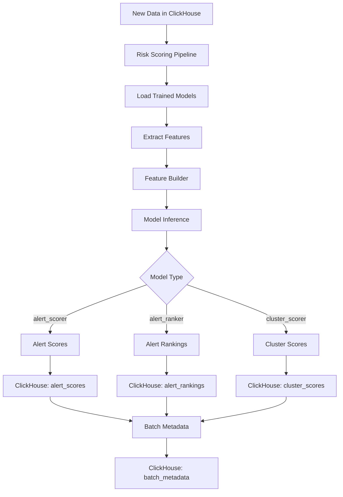

# Risk Scoring Pipeline Implementation Plan

## Overview

This plan outlines the implementation of the **risk scoring (inference) pipeline** that uses the trained ML models to score production alerts, rank them, and score clusters in real-time or batch mode.

## Current State

✅ **Completed:**
- Training pipeline for 3 model types: `alert_scorer`, `alert_ranker`, `cluster_scorer`
- Models saved to `data/trained_models/{network}/`
- Metadata stored in ClickHouse `trained_models` table
- Feature extraction from ClickHouse working correctly
- Decimal arithmetic properly handled

## Architecture Overview



## Pipeline Components

### 1. Model Loader

**Purpose:** Load trained models from disk with version management

**Key Features:**
- Load latest model for a given network and model type
- Support loading specific model versions
- Validate model compatibility with current feature schema
- Cache models in memory for performance

**Implementation:**
```python
class ModelLoader:
    def load_latest_model(network: str, model_type: str) -> XGBClassifier
    def load_model_version(model_path: Path) -> XGBClassifier
    def get_model_metadata(model_path: Path) -> Dict
```

### 2. Feature Extractor (Reuse Existing)

**Purpose:** Extract features for scoring from ClickHouse

**Reuse:** `packages/training/feature_extraction.py`

**Modifications Needed:**
- Add method for extracting specific processing_date data (already exists)
- Ensure it handles production data (not just training data)

### 3. Inference Feature Builder

**Purpose:** Build feature matrix for inference (same as training)

**Reuse:** `packages/training/feature_builder.py`

**Key Difference from Training:**
- No labels needed (y)
- Only returns X (feature matrix)
- Same feature engineering as training to ensure consistency

**New Method:**
```python
def build_inference_features(data: Dict[str, pd.DataFrame]) -> pd.DataFrame:
    """Build features without labels for inference"""
```

### 4. Score Generator

**Purpose:** Generate predictions using loaded models

**Key Features:**
- Support batch prediction for efficiency
- Handle different model types (alert_scorer, alert_ranker, cluster_scorer)
- Track prediction latency for monitoring

**Implementation:**
```python
class ScoreGenerator:
    def score_alerts(model, features: pd.DataFrame) -> pd.Series
    def rank_alerts(model, features: pd.DataFrame) -> pd.Series
    def score_clusters(model, features: pd.DataFrame) -> pd.Series
```

### 5. Score Writer

**Purpose:** Write scores to ClickHouse output tables

**Key Features:**
- Write to `alert_scores`, `alert_rankings`, `cluster_scores`
- Update `batch_metadata` with processing statistics
- Handle Decimal types correctly (learned from training fixes)

**Implementation:**
```python
class ScoreWriter:
    def write_alert_scores(scores: pd.DataFrame)
    def write_alert_rankings(rankings: pd.DataFrame)
    def write_cluster_scores(scores: pd.DataFrame)
    def update_batch_metadata(metadata: Dict)
```

## Workflow

### Batch Processing Workflow

```
1. INPUT: processing_date, network, window_days
2. Load latest models for all 3 types
3. Extract raw data from ClickHouse
4. Build features using FeatureBuilder
5. Generate predictions:
   a. Alert scores (0-1 probability)
   b. Alert rankings (1-N ranking)
   c. Cluster scores (0-1 probability)
6. Write scores to ClickHouse
7. Update batch_metadata with stats
8. Log completion metrics
```

### Real-time Processing Workflow (Future)

```
1. Listen for new alerts in ClickHouse
2. Extract features for new alerts
3. Score immediately using cached models
4. Write scores to output tables
5. Trigger notifications for high-risk alerts
```

## Data Flow

### Input Tables (ClickHouse)
- `raw_alerts` - Alert data
- `raw_features` - Address features
- `raw_clusters` - Cluster information
- `raw_money_flows` - Transaction flows
- `raw_address_labels` - Address labels (optional for inference)

### Output Tables (ClickHouse)
- `alert_scores` - Individual alert risk scores (0-1)
- `alert_rankings` - Alert priority rankings (1-N)
- `cluster_scores` - Cluster risk scores (0-1)
- `batch_metadata` - Processing metadata and performance metrics

## Schema Alignment

### alert_scores Table
```sql
processing_date Date
alert_id String
score Float64              -- Model prediction (0-1)
model_version String       -- e.g., "alert_scorer_v1.0.0"
latency_ms Float64         -- Prediction time
explain_json String        -- SHAP values (future)
created_at DateTime
```

### alert_rankings Table
```sql
processing_date Date
alert_id String
rank Int32                 -- 1 = highest priority
model_version String
created_at DateTime
```

### cluster_scores Table
```sql
processing_date Date
cluster_id String
score Float64              -- Cluster risk score
model_version String
created_at DateTime
```

### batch_metadata Table Updates
```sql
processing_date Date
processed_at DateTime
input_counts_alerts Int32
output_counts_alert_scores Int32
output_counts_alert_rankings Int32
output_counts_cluster_scores Int32
latencies_ms_alert_scoring Int32
latencies_ms_alert_ranking Int32
latencies_ms_cluster_scoring Int32
latencies_ms_total Int32
model_versions_alert_scorer String
model_versions_alert_ranker String
model_versions_cluster_scorer String
status Enum('PROCESSING', 'COMPLETED', 'FAILED')
error_message String
```

## File Structure

```
packages/
  scoring/
    __init__.py
    risk_scoring.py           # Main orchestrator
    model_loader.py           # Load models from disk
    inference_builder.py      # Build features for inference
    score_generator.py        # Generate predictions
    score_writer.py           # Write to ClickHouse
    
scripts/
  score_batch.py              # CLI for batch scoring
```

## Implementation Approach

### Phase 1: Core Inference Components
1. Create `ModelLoader` class
2. Add `build_inference_features()` to FeatureBuilder
3. Create `ScoreGenerator` class
4. Create `ScoreWriter` class

### Phase 2: Orchestration
1. Create `RiskScoring` main class
2. Implement batch processing workflow
3. Add error handling and logging

### Phase 3: CLI & Testing
1. Create `scripts/score_batch.py` CLI
2. Test with training data (compare with training predictions)
3. Test with production data

### Phase 4: Monitoring & Optimization
1. Add performance metrics tracking
2. Optimize batch size for memory efficiency
3. Add model version tracking

## Key Design Decisions

### 1. Feature Consistency
**Decision:** Reuse exact same FeatureBuilder from training
**Rationale:** Ensures training/inference feature parity, prevents subtle bugs

### 2. Model Version Management
**Decision:** Store model version with each prediction
**Rationale:** Enables A/B testing, rollback, and auditability

### 3. Batch vs Real-time
**Decision:** Start with batch, design for real-time future
**Rationale:** Batch is simpler, covers immediate needs, can evolve to streaming

### 4. Decimal Handling
**Decision:** Apply same Decimal→float conversions as training
**Rationale:** Learned from training pipeline fixes, ensures consistency

### 5. Error Handling
**Decision:** Fail fast, log errors, update batch_metadata status
**Rationale:** Quick debugging, clear failure tracking

## CLI Interface

```bash
# Score all alerts for a specific date
python scripts/score_batch.py \
  --network torus \
  --processing-date 2025-08-01 \
  --window-days 195 \
  --model-types alert_scorer alert_ranker cluster_scorer

# Score with specific model versions
python scripts/score_batch.py \
  --network torus \
  --processing-date 2025-08-01 \
  --window-days 195 \
  --alert-scorer-version v1.0.0 \
  --alert-ranker-version v1.0.0 \
  --cluster-scorer-version v1.0.0

# Score date range
python scripts/score_batch.py \
  --network torus \
  --start-date 2025-08-01 \
  --end-date 2025-08-31 \
  --window-days 195
```

## Performance Considerations

### Memory Management
- Load models once, reuse for batch
- Process alerts in chunks if needed (e.g., 10k at a time)
- Clear large DataFrames after processing

### Prediction Speed
- XGBoost is fast: ~1000 predictions/second on CPU
- 86 alerts = <0.1 seconds prediction time
- Bottleneck will be ClickHouse I/O, not ML

### Monitoring Metrics
- Prediction latency per model type
- Batch processing time
- Score distribution (detect model drift)
- Error rates

## Testing Strategy

### 1. Unit Tests
- Test each component independently
- Mock ClickHouse connections
- Verify Decimal handling

### 2. Integration Tests
- Test full pipeline on training data
- Compare scores with training predictions
- Verify ClickHouse writes

### 3. Production Validation
- Score historical data
- Compare distributions with training
- Manual review of high-risk alerts

## Error Scenarios & Handling

| Scenario | Handling |
|----------|----------|
| Model file not found | Raise ValueError with clear message |
| Feature schema mismatch | Log warning, attempt to adapt or fail |
| ClickHouse connection failure | Retry 3 times, then fail with error in batch_metadata |
| Empty input data | Log warning, skip scoring, mark batch as COMPLETED |
| Prediction error | Log error, mark affected alerts as NULL, continue |
| Decimal type error | Apply same conversions as training (already fixed) |

## Success Criteria

✅ **Functional:**
- All 3 model types score successfully
- Scores written to correct ClickHouse tables
- batch_metadata tracks all operations

✅ **Performance:**
- Process 1000 alerts in <10 seconds
- Prediction latency <1ms per alert

✅ **Quality:**
- Feature parity between training and inference
- Model versions tracked
- Clear error messages and logging

## Next Steps After Implementation

1. **Model Monitoring:** Track score distributions over time
2. **Alerting:** Trigger notifications for high-risk alerts
3. **A/B Testing:** Compare model versions in production
4. **Real-time Scoring:** Implement streaming pipeline
5. **Explainability:** Add SHAP values to explain predictions

## Timeline Estimate

- Phase 1 (Core Components): 1 day
- Phase 2 (Orchestration): 0.5 day
- Phase 3 (CLI & Testing): 0.5 day
- Phase 4 (Monitoring): 0.5 day

**Total: 2.5 days of development**

## Risks & Mitigations

| Risk | Impact | Mitigation |
|------|--------|------------|
| Feature drift between train/inference | High | Reuse exact same FeatureBuilder |
| Model file corruption | Medium | Version control, checksums |
| ClickHouse performance | Medium | Batch writes, index optimization |
| Decimal type errors | High | Apply same fixes as training (already done) |
| Memory issues with large batches | Low | Chunked processing |

## Decision Points

**Please decide:**

1. **Start with which approach?**
   - [ ] Batch processing only (recommended)
   - [ ] Real-time + Batch

2. **Model loading strategy?**
   - [ ] Load latest model automatically (recommended)
   - [ ] Require explicit version specification

3. **Error handling preference?**
   - [ ] Fail fast on any error
   - [ ] Continue on errors, log and track (recommended)

4. **Priority order?**
   - [ ] All 3 model types together (recommended)
   - [ ] Start with alert_scorer only

5. **Testing approach?**
   - [ ] Test on training data first (recommended)
   - [ ] Go straight to production data